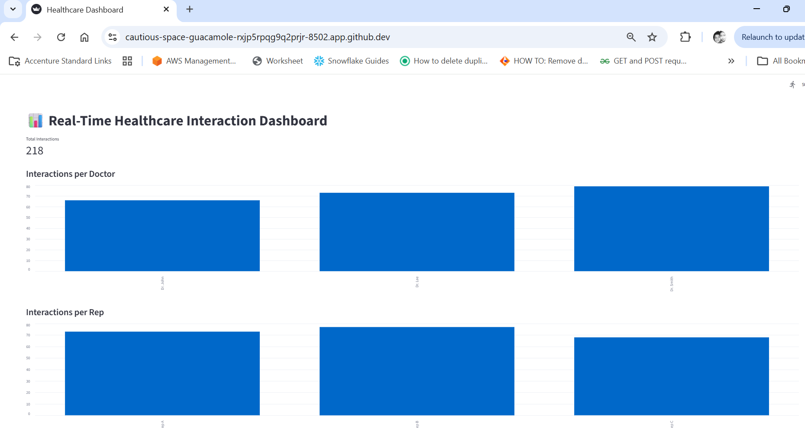
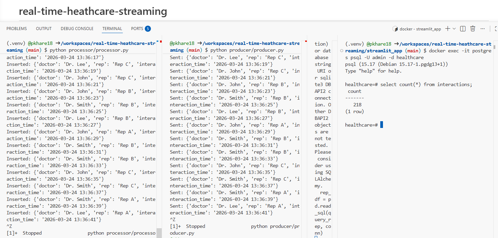

# 🏥 Real-Time Healthcare Data Pipeline (Kafka + PostgreSQL + Streamlit)

------------------------------------------------------------------------

## 📌 Overview

This project demonstrates a **real-time data engineering pipeline** that
simulates healthcare interaction data and processes it end-to-end using
modern data stack components.

The system ingests streaming data, processes it in real-time, stores it
in PostgreSQL, and visualizes insights through an interactive Streamlit
dashboard.

------------------------------------------------------------------------

## 🏗️ Architecture Diagram

    Producer → Redpanda (Kafka) → Processor → PostgreSQL → Streamlit Dashboard

------------------------------------------------------------------------

## 🔄 Data Flow

1.  Producer generates real-time healthcare interaction events\
2.  Kafka ingests and streams events\
3.  Processor consumes and writes to PostgreSQL\
4.  PostgreSQL stores structured data\
5.  Streamlit visualizes real-time insights

------------------------------------------------------------------------

## 🧰 Tech Stack

-   Streaming: Redpanda (Kafka-compatible)
-   Processing: Python
-   Database: PostgreSQL
-   Visualization: Streamlit
-   Containerization: Docker
-   Config: .env

------------------------------------------------------------------------

## 📊 Dashboard



------------------------------------------------------------------------

## 🔍 Pipeline Validation



-   Producer sending data\
-   Processor inserting data\
-   Verified via psql\
-   Dashboard updating

------------------------------------------------------------------------

## ⚙️ Setup & Run

### Start Infra

docker-compose up -d

### Setup Env

DB_HOST=localhost DB_NAME=healthcare DB_USER=***** DB_PASSWORD=*****

### Install

pip install -r requirements.txt

### Run

Terminal 1: python processor/processor.py

Terminal 2: python producer/producer.py

Terminal 3: streamlit run streamlit_app/app.py --server.port 8501
--server.address 0.0.0.0

## 🚀 Quick Start
 
Run entire pipeline with one command:
 
```bash
./start.sh
------------------------------------------------------------------------

## 🧪 Validation

docker exec -it postgres psql -U admin -d healthcare

SELECT COUNT(\*) FROM interactions;


------------------------------------------------------------------------

## 🛠️ Challenges & Solutions

-   DuckDB lock issue → migrated to PostgreSQL\
-   Env variables → used .env\
-   Path issues → fixed config\
-   Validation → used CLI + dashboard

------------------------------------------------------------------------

## 🎯 Learnings

-   Real-time pipelines\
-   Kafka streaming\
-   DB concurrency\
-   System design


------------------------------------------------------------------------

## 📌 Conclusion

Production-style real-time pipeline with streaming, processing, storage,
and visualization.


